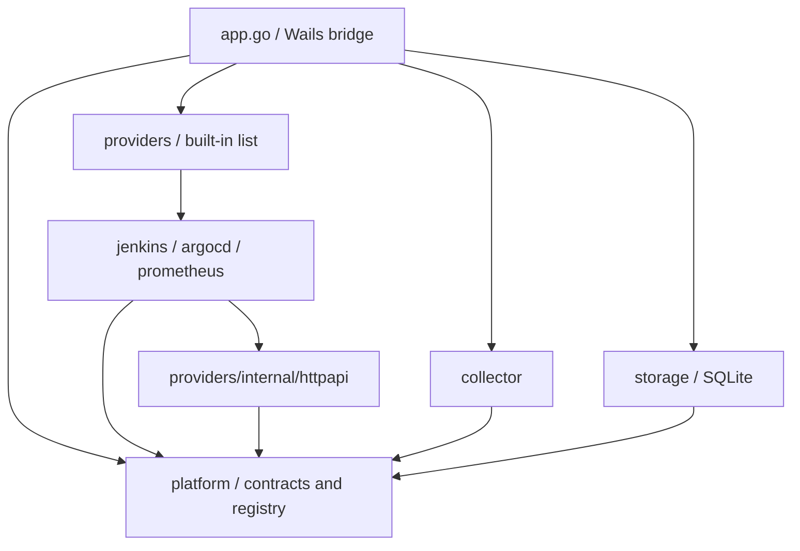

# Architecture and extension boundaries

The application composes capabilities instead of inheriting a universal data class. A time series, a build execution, and a deployment snapshot have different identity and retention semantics. Flattening them into an untyped payload would move those differences into every caller.

## Repository layout

```text
dashboard/
├── main.go                      # Wails entry point and window setup
├── app.go                       # Compose packages, credentials, scheduling, UI bridge
├── internal/
│   ├── platform/                # Shared models, capability interfaces, registry, validation
│   ├── collector/               # Polling policies; depends on capability and archive contracts
│   ├── storage/                 # SQLite settings, build archive, preferences, backup
│   ├── providers/
│   │   ├── builtin.go           # Explicit list of shipped provider definitions
│   │   ├── jenkins/             # API translation, metadata, fixture tests
│   │   ├── argocd/              # API translation, session authentication, fixture tests
│   │   ├── prometheus/          # API translation, PromQL presets, fixture/live tests
│   │   └── internal/httpapi/    # Transport shared only within providers
│   ├── demo/                   # Synthetic HTTP services and integration smoke test
│   └── architecture/           # Production import-boundary regression test
├── frontend/src/
│   ├── main.ts                 # Navigation, page state, rendering and event coordination
│   ├── bridge/                 # Wails access, bridge contract, browser fixture
│   ├── components/chart.ts     # Numeric-series rendering and chart lifecycle
│   ├── shared/                 # Data contracts and display formatting
│   └── style.css
├── frontend/tests/             # Browser acceptance tests
├── examples/                   # User configuration guidance
└── scripts/                    # Repeatable build and test commands
```

These are Go **packages inside one module**, with one root `go.mod`. Each adapter owns its implementation, metadata, and tests. Adding a tool does not require another repository, module, or executable.

## Dependency direction

Arrows mean “imports”; the application is the composition point.



- `platform` uses only the standard library. It cannot import providers, SQLite, or Wails.
- `collector` imports `platform` and the standard library. Its `BuildArchive` interface requires only `Known`, `SaveBuilds`, and `Running`; `app.go` passes the SQLite implementation.
- `storage` knows the shared data models, but not providers or collection scheduling.
- Each provider imports the contracts and optionally the shared HTTP client. Providers do not import one another, the collector, or storage.
- `providers/builtin.go` owns the shipped registration list. A provider's `Definition()` owns metadata, construction, and optional provider-specific connection validation.
- The frontend's `bridge/index.ts` selects Wails or the browser fixture. Charts consume normalized numeric series, without querying upstream APIs.

`internal/architecture/boundaries_test.go` checks production Go imports during `go test ./...`. Integration tests may compose multiple layers. Go's nested `internal` directory also prevents packages outside `providers` from importing its HTTP helper.

The current extension model is **source contributions compiled with the app**. Go's `internal/platform` is a contract for packages in this repository, not a separately versioned public SDK or runtime plugin API. An independently distributed plugin SDK would need an explicit compatibility and loading design.


## Data contracts

| Capability | Contract / normalized data | Identity and time | Storage |
| --- | --- | --- | --- |
| Build executions | `BuildSource` → `Build` | Connection + target + numeric build number + start time; milliseconds | SQLite archive; duplicate observations upsert |
| Queue | `QueueSource` → `QueueItem` | Current queue item and target; queued-at milliseconds | Latest snapshot in memory |
| Deployments | `DeploymentSource` → `Deployment` | Stable source ID, revision(s), independent sync/health and operation state | Latest snapshot in memory |
| Time series | `MetricSource` → `QueryResult` → labelled `Series` → `Point` | Label set + timestamp in Unix seconds; nullable numeric value | Queried from upstream; not a local metrics warehouse |

`Provider` supplies connection checking and target discovery. Implement any combination of capabilities. For example, a build-only service does not need a fake queue method. A platform exposing both deployments and metrics implements both contracts; both are collected. `CI`, `CD`, and `Monitoring` remain compatibility names for existing callers.

Targets may declare `capabilities`. A combined provider can return one target for `builds` and another for `deployments`, preventing deployment identifiers from being passed to build endpoints. An empty capability list retains the legacy behavior for single-purpose providers.

## Responsibilities

- `platform/model.go` defines normalized DTOs and independent capabilities. `registry.go` checks registration and interface/metadata consistency; `validation.go` checks shared connection fields.
- `collector/collector.go` orchestrates one connection. `collect_builds.go`, `collect_queue.go`, `collect_deployments.go`, and `collect_metrics.go` own their respective collection policies.
- `storage/sqlite.go` owns the unchanged archive schema, connection settings, preferences, and backup behavior.
- `providers/<name>` owns API paths, response decoding, platform authentication, supported configuration, and tests. PromQL presets live in `providers/prometheus/presets.go`.
- `app.go` owns desktop lifecycle, credential storage, registry composition, poll scheduling, and frontend methods.

Provider identity does not select collection policy: implemented interfaces select capabilities. Protocol-specific validation uses the optional `Definition.Validate` callback; Argo CD local-account username validation lives with Argo CD. Authentication protocol implementation is still required when introducing a new authentication method.

## Failures and freshness

Each snapshot contains `modules[capability]` with `attempted`, `lastSuccess`, and `error`. A deployment failure does not mark a successful metrics or build response as failed. The aggregate error remains available for the connection banner, while rule freshness uses the metrics module. Previously published status maps are not mutated.

Capabilities run serially inside a bounded connection cycle. Independent error handling does not mean independent CPU/thread scheduling: a slow capability can consume the shared cycle timeout and leave later capabilities cancelled. The desktop currently allows two connection/query operations concurrently. There is no distributed scheduler or background service.

Query text is interpreted by the adapter. The frontend uses declared language, default expression, and presets, and separates favorites by language. It renders normalized numeric series without parsing PromQL or SQL. The SQL fixture is an extension test, not an implemented SQL monitoring backend.

## Proven extension path

`collector/extensibility_test.go` is in the external `collector_test` package. It implements a combined provider using only public contracts, registers it through `Definition`, and collects builds, deployments, and synthetic SQL-shaped metrics without changing core collection code. The test checks target routing, absence of a queue, per-module failure isolation, immutable prior status, cancellation, and archive deduplication.

The browser suite independently injects a new provider name and SQL query metadata. It verifies the default expression, query execution, and the coexistence of target selection and metric-rule editing. These are contract proofs, not claims that a real fourth vendor has been integrated.

## Remaining boundaries

The first modularization deliberately preserves the existing SQLite format and historical collection algorithm. Build identifiers are still positive integers; pages are newest-first groups of 100 addressed by offset, with overlapping historical reads. A UUID-only build API or cursor-only pagination still needs a contract/storage change. Do not hash an opaque ID into a number or invent a start time to fit this contract.

The proposed next change is explicit: replace numeric lookup keys with a string build ID; make page continuation an opaque provider cursor; migrate the archive transactionally from `(connection, job, number, started)` to `(connection, job, build_id, started)` while retaining `number` for display. Preserve existing IDs as decimal strings, validate record counts and uniqueness before committing, and test opening/restoring both old and migrated databases. A source backup was created before this refactor. This migration has **not** been applied.

Logs, traces, alerts, DORA calculations, and metrics retention are not represented by the current four contracts. They require additional typed capabilities with explicit semantics. Page rendering and event coordination remain in `frontend/src/main.ts`; the bridge, shared contracts/formatters, and chart component are separate modules. Existing capabilities can be extended without adding vendor-specific frontend polling. A new data capability still needs an explicit UI and collection contract.
