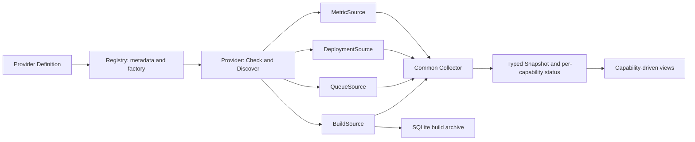

# Collection modules and extension boundaries

The application composes capabilities instead of inheriting a universal data class. A time series, a build execution, and a deployment snapshot have different identity and retention semantics. Flattening them into an untyped payload would move those differences into every caller.

## Data contracts

| Capability | Contract / normalized data | Identity and time | Storage |
| --- | --- | --- | --- |
| Build executions | `BuildSource` → `Build` | Connection + target + numeric build number + start time; milliseconds | SQLite archive; duplicate observations upsert |
| Queue | `QueueSource` → `QueueItem` | Current queue item and target; queued-at milliseconds | Latest snapshot in memory |
| Deployments | `DeploymentSource` → `Deployment` | Stable source ID, revision(s), independent sync/health and operation state | Latest snapshot in memory |
| Time series | `MetricSource` → `QueryResult` → labelled `Series` → `Point` | Label set + timestamp in Unix seconds; nullable numeric value | Queried from upstream; not a local metrics warehouse |

`Provider` supplies connection checking and target discovery. Implement any combination of capabilities. For example, a build-only service does not need a fake queue method. A platform exposing both deployments and metrics implements both contracts; both are collected. `CI`, `CD`, and `Monitoring` remain compatibility names for existing callers.

Targets may declare `capabilities`. A combined provider can return one target for `builds` and another for `deployments`, preventing deployment identifiers from being passed to build endpoints. An empty capability list retains the legacy behavior for single-purpose providers.

## Responsibilities

- `model.go`: public contracts and normalized DTOs; no platform query presets.
- `registry.go`: provider definitions, configuration validation, duplicate detection, and consistency checks between declared capabilities and implemented interfaces.
- `builtin.go`: the composition point for Jenkins, Argo CD, and Prometheus. New external definitions can also be passed to `NewApp(demoMode, definitions...)` from `main.go`.
- `collector.go`: orchestrates independent capabilities, serializes polling for a connection, respects cancellation, and publishes per-capability attempt/success/error state.
- `collect_builds.go`: current build pages, historical import, local archive updates, and unfinished-build reconciliation.
- `collect_queue.go`, `collect_deployments.go`, `collect_metrics.go`: typed collection policies for their respective data.
- `jenkins.go`, `argocd.go`, `prometheus.go`: protocol translation and provider-specific authentication.
- `prometheus_presets.go`: built-in PromQL examples. Other metric sources provide their own query language, default expression, and presets in `ProviderInfo.Query`.
- `app.go`: desktop lifecycle, credential storage, registry injection, poll scheduling, and the frontend bridge.

Provider identity is not used to select a collection policy. Interfaces select the modules. A registry entry describes `builds`, `queue`, `deployments`, or `metrics`; the registry rejects missing or undeclared implementations. It also supplies the polling interval and authentication choices. Protocol-specific authentication still lives in an adapter; adding OAuth is not implied by adding a metadata string.

## Failures and freshness

Each snapshot contains `modules[capability]` with `attempted`, `lastSuccess`, and `error`. A deployment failure does not mark a successful metrics or build response as failed. The aggregate error remains available for the connection banner, while rule freshness uses the metrics module. Previously published status maps are not mutated.

Capabilities run serially inside a bounded connection cycle. Independent error handling does not mean independent CPU/thread scheduling: a slow capability can consume the shared cycle timeout and leave later capabilities cancelled. The desktop currently allows two connection/query operations concurrently. There is no distributed scheduler or background service.

Query text is interpreted by the adapter. The frontend uses declared language, default expression, and presets, and separates favorites by language. It renders normalized numeric series without parsing PromQL or SQL. The SQL fixture is an extension test, not an implemented SQL monitoring backend.

## Proven extension path

`extensibility_test.go` is in the external `platform_test` package. It implements a combined provider using only public contracts, registers it through `Definition`, and collects builds, deployments, and synthetic SQL-shaped metrics without changing core collection code. The test checks target routing, absence of a queue, per-module failure isolation, immutable prior status, cancellation, and archive deduplication.

The browser suite independently injects a new provider name and SQL query metadata. It verifies the default expression, query execution, and the coexistence of target selection and metric-rule editing. These are contract proofs, not claims that a real fourth vendor has been integrated.

## Remaining boundaries

The first modularization deliberately preserves the existing SQLite format and historical collection algorithm. Build identifiers are still positive integers; pages are newest-first groups of 100 addressed by offset, with overlapping historical reads. A UUID-only build API or cursor-only pagination still needs a contract/storage change. Do not hash an opaque ID into a number or invent a start time to fit this contract.

The proposed next change is explicit: replace numeric lookup keys with a string build ID; make page continuation an opaque provider cursor; migrate the archive transactionally from `(connection, job, number, started)` to `(connection, job, build_id, started)` while retaining `number` for display. Preserve existing IDs as decimal strings, validate record counts and uniqueness before committing, and test opening/restoring both old and migrated databases. A source backup was created before this refactor. This migration has **not** been applied.

Logs, traces, alerts, DORA calculations, and metrics retention are not represented by the current four contracts. They require additional typed capabilities with explicit semantics. The UI rendering is still primarily in `frontend/src/main.ts`; this work separates provider and collection behavior, not every view component.
